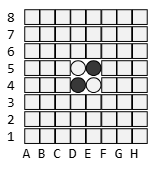
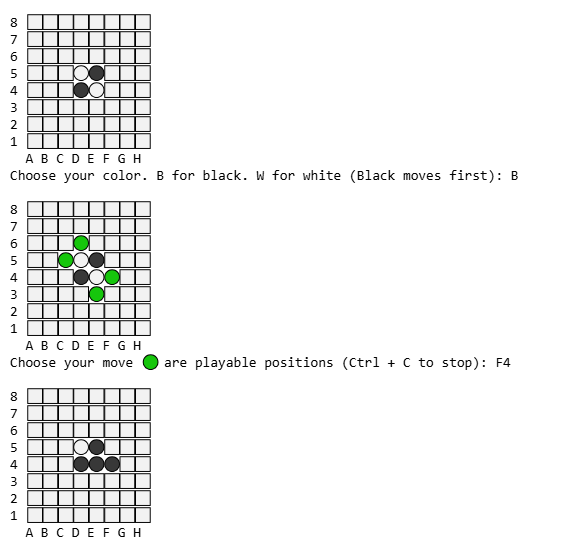
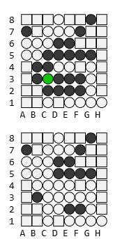
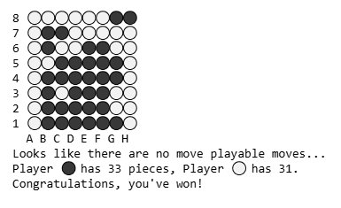

# Emoji Othello
### Rules
<pre>
Othello is played on a 8x8 board like chess or checkers.

The goal is to have the most discs in your color at the end of the game.

The game ends when there are no more playable moves for BOTH players.

Black moves first. The board starts as shown in the following image.
</pre>

<pre>
On your turn you place your colored disc on a playable position using its
location name by column and row. A playable position is any location that
outflanks your opponent's discs. Once placed your opponent's discs are
flipped to your color.
</pre>

<pre>
If there are no playable positions, that is to say you cannot place a disc
in such a way that it outflanks your opponent's discs, then the turn
is forfeited to the other player. Meaning there may be an occasion where
a player gets more than one turn.

A disc may outflank any number of discs in one or more rows. A row is
defined as a straight line horizonal, vertical, or diagonal in which a
disc is able to outflank from a played position.
</pre>

<pre>
When the game ends all the discs are counted and the player with the most
discs wins. At anytime the game can be stopped with the keyboard combination
Ctrl + C
</pre>

### Setup
<pre>
Emoji_Othello.py contains the main method. Download and navigate to its location
in a terminal and type: python Emoji_Othello.py

The game is currently single player only.
</pre>